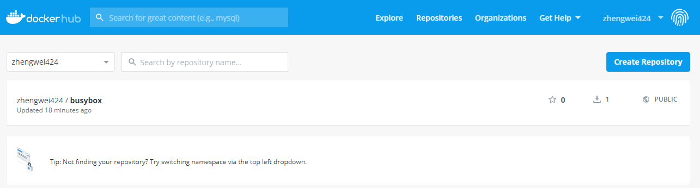
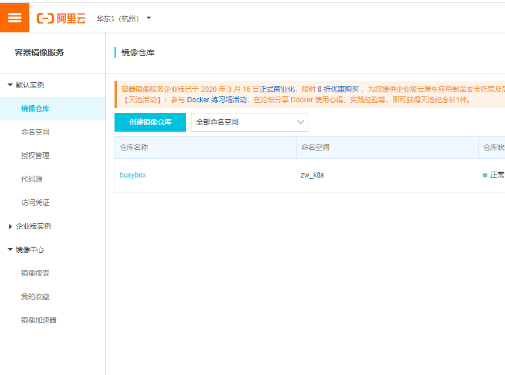
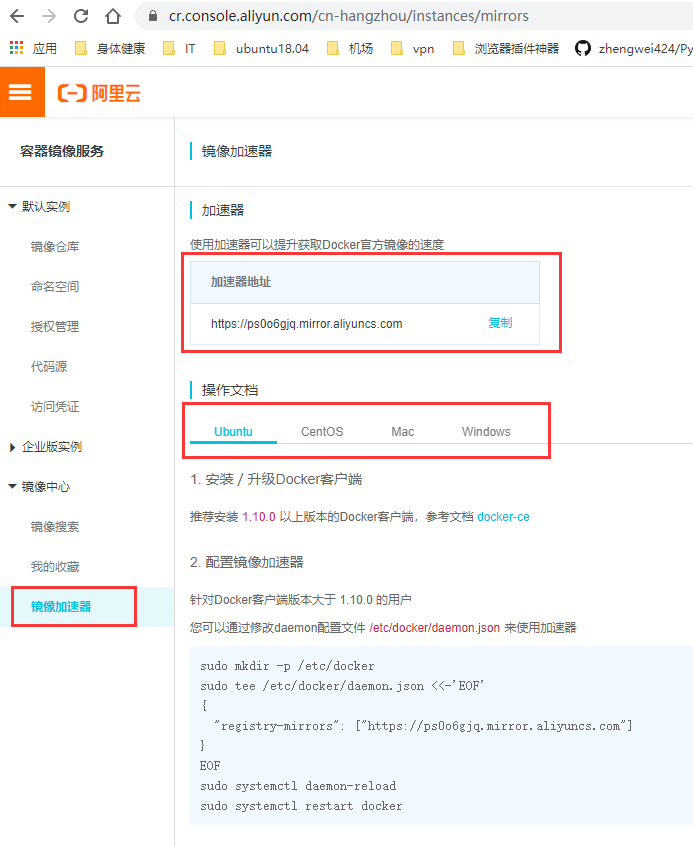

# 1. Docker Hub

## 创建一个镜像仓库

==仓库名就是镜像名==

例：创建一个busybox镜像仓库




## 账号登录

```shell
# docker login <直接回车>
```


## 推送镜像（前提是先docker login）

```shell
# docker tag local-image:tagname new-repo:tagname
# docker push new-repo:tagname
```

例：

```shell
# docker tag busybox:1.28 zhengwei424/busybox:1.28
# docker push zhengwei424/busybox:1.28
```


## 搜索镜像

```shell
# docker search 镜像名称
```


## 拉取镜像

```shell
# docker pull 镜像名称
```


# 2. 阿里云docker镜像仓库

使用方法：

登录阿里云——>在搜索栏输入"容器镜像服务"——[点击进入](https://cr.console.aliyun.com/cn-hangzhou/instances/repositories)



## 使用方法

1. 创建命名空间

2. 创建镜像仓库（即待上传的镜像名）

3. 操作镜像

   1. 登录阿里云Docker Registry

      ```shell
      $ sudo docker login --username=运维青年 registry.cn-hangzhou.aliyuncs.com
      ```

      

   2. 从Registry中拉取镜像

      ```shell
      $ sudo docker pull registry.cn-hangzhou.aliyuncs.com/zw_k8s/busybox:[镜像版本号]
      ```

      

   3. 将镜像推送到Registry

      ```shell
      $ sudo docker login --username=运维青年 registry.cn-hangzhou.aliyuncs.com
      $ sudo docker tag [ImageId] registry.cn-hangzhou.aliyuncs.com/zw_k8s/busybox:[镜像版本号]
      $ sudo docker push registry.cn-hangzhou.aliyuncs.com/zw_k8s/busybox:[镜像版本号]
      ```

4. [获取镜像加速](https://cr.console.aliyun.com/cn-hangzhou/instances/mirrors)

   

# 3. Azure中国提供了gcr.io/k8s.gcr.io镜像代理服务

拉取时需要改一下前缀，等pull完了以后再tag为新的镜像名。

```shell
# docker pull gcr.azk8s.cn/google_containers/<imagename>:<version>
```

[Azure开源镜像站点](http://mirror.azure.cn/)

懒人脚本：(自动拉取镜像，特换标签，删除镜像)

docker-wrapper

```python
#!/bin/env python
# _*_coding: utf-8 _*_

import os
import sys

converts = [
    {
        'prefix': ['gcr.io', 'k8s.gcr.io'],
        'replace': ['gcr.azk8s.cn/google_containers', 'registry.cn-hangzhou.aliyuncs.com/google_containers',
                    'mirrorgooglecontainers']
    },
    {
        'prefix': ['docker.io'],
        'replace': ['dockerhub.azk8s.cn']
    }
]


def execute_sys_cmd(cmd):
    result = os.system(cmd)
    if result != 0:
        print(cmd + " failed.")
        sys.exit(-1)


def usage():
    print("Usage: " + sys.argv[0] + " pull ${image}")


if __name__ == "__main__":
    if len(sys.argv) != 3:
        usage()
        sys.exit(-1)

    image = sys.argv[2]
    imageArray = image.split("/")

    newImage = ''
    for cvt in converts:
        if imageArray[0] in cvt['prefix']:
            for i in cvt['replace']:
                newImage = image.replace(imageArray[0], i)
                if newImage:
                    print("-- pull {image} from {newimage} instead --".format(image=image, newimage=newImage))
                    cmd = "docker pull {image}".format(image=newImage)
                    try:
                        execute_sys_cmd(cmd)
                    except SystemExit as e:
                        print("'{}' is failed").format(cmd)
                        continue

                    cmd = "docker tag {newImage} {image}".format(newImage=newImage, image=image)
                    execute_sys_cmd(cmd)

                    cmd = "docker rmi {newImage}".format(newImage=newImage)
                    execute_sys_cmd(cmd)

                    print("-- pull {image} done --".format(image=image))
                    sys.exit(0)
        else:
            cmd = "docker pull {image}".format(image=image)
            execute_sys_cmd(cmd)
            sys.exit(0)
```


用法：

```shell
docker-wrapper pull k8s.gcr.io/kube-apiserver:v1.14.1
docker-wrapper pull gcr.io/google_containers/kube-apiserver:v1.14.1
docker-wrapper pull nginx
docker-wrapper pull silenceshell/godaddy:0.0.2
```

